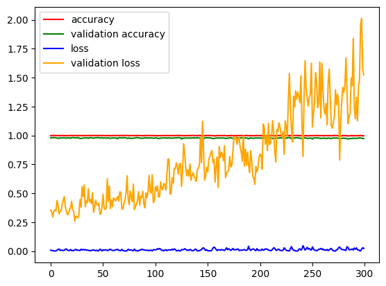
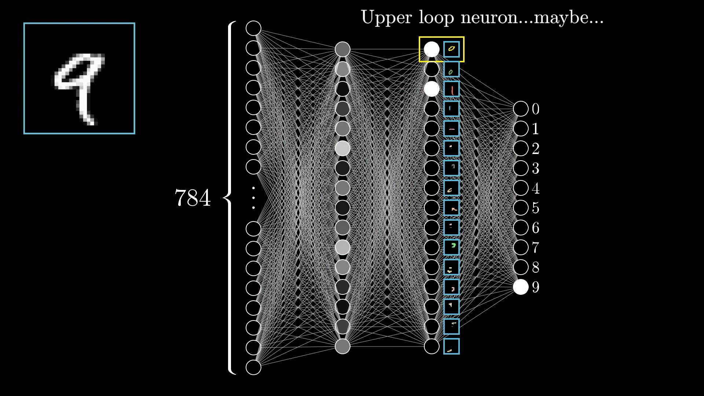

# mnist-datasets
 Mnist Datasets  Deep Learning Python

## Image
History





MNIST



## install Package
```
pip install matplotlib
```
```
pip install numpy
```
```
pip install tensorflow
```
## Questions
Email For questions 

mohammedaghaei401@gmail.com